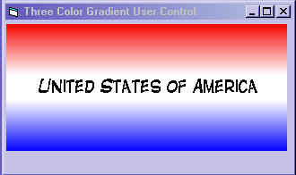



## Three Color Gradient Usercontrol

### Description

I was just playing around with usercontrol code and made this gradient usercontrol. I've included the caption feature mainly for the screenshot.Its limited in function.Hope it comes in handy for someone.Enjoy and howdy from Texas.
 
### More Info
 

             |
---                |---
**Submitted On**   |2004-09-19 14:08:50
**By**             |[Kenneth Foster](https://github.com/Planet-Source-Code/PSCIndex/blob/master/ByAuthor/kenneth-foster.md)
**Level**          |Intermediate
**User Rating**    |5.0 (10 globes from 2 users)
**Compatibility**  |VB 6\.0
**Category**       |[Custom Controls/ Forms/  Menus](https://github.com/Planet-Source-Code/PSCIndex/blob/master/ByCategory/custom-controls-forms-menus__1-4.md)
**World**          |[Visual Basic](https://github.com/Planet-Source-Code/PSCIndex/blob/master/ByWorld/visual-basic.md)
**Archive File**   |[Three\_Colo1795699192004\.zip](https://github.com/Planet-Source-Code/kenneth-foster-three-color-gradient-usercontrol__1-56260/archive/master.zip)

